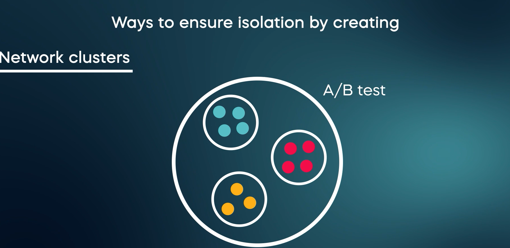

1. Can we expect the same effect when we roll ouit the test to the whole population? 
- In normal case, the probably "yes" but it depents on the season like chirstmans and more. 
- This can be **no** when we hava some seasonal changes and some other stuff. To solve this we an follow two solutions (1. Network clusters, 2. Ego clusters randomization ). 
- Network clusters: create a cluster of people and test the product in the cluster itself. 
- Ego Cluster randomization: we select users and their closest friends instead of whole clusterss. 

    

2. You tested a application and it worked well and you rollout the application its been 2 weeks but no results. 

- This is because of this two effects 
1. Primacy effect ( first people will be skeptical after then people will like it )
2. Novelty effect (first people wll like it and overtime the liking will be disspiates over time)

3. Multiple Testing 
* You can introduce this new metrics for this 

1. False discovery rate 
2. Boneferroni correction 

4. what would you do if an A/B test is not an option? 

- If you do have available data, you can introduce qualitative research methods liek surveys, interview. 
- If you already a released the feature, you can introduce **generalized synthetic control group** and compare behavior of them. 
- Final solution is to do the **Time series analysis**. This approach have some drawback.
- 

